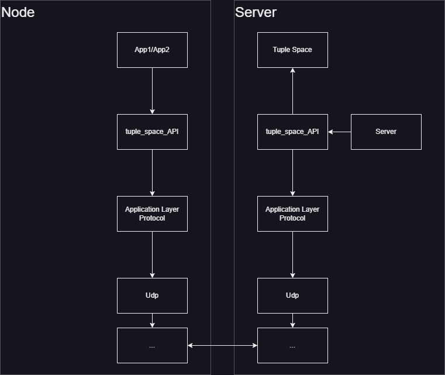

# Tuple Space implementation

## About
Repository containing semestral project for "Programming Internet of Things Systems" course.
Project was about implementing tuple space as a server operating in Linux environment. Additionaly two separate Arduino nodes were created that were using tuple space to perform specific tasks. Arduino nodes were emulated using emulator provided by administrator of the course.

## Dependency Diagram 




## Application Layer Protocol
         2                  14   15    16
    +-+-+-+-+-+-+-+-+-+-+-+-+-+-+-+-+-+-+
    | PT |  sequenuce_number | OP | Ack |
    +----+-------------------+----+-----+
    |              Payload ...              
    +-----------------------------------+
    

- PT - Payload type : 00 = Ack message, 01 = Out message, 10 = Rdp message, 11 = Inp message
- Sequence_number - NOT IMPLEMENTED
- OP - Operation Result : 1 = Tuple retrived from Tuple Space, 0 = Tuple not present in Tuple Space 
- Ack - Acknowledge : determines whether message is acknowledge message

Protocol uses receiving and sending "routines". 
### Receiving routine
Non blocking function that receives character buffor and sends ack message to sender.

### Sending routine
Blocking function that sends character buffor and waits some amount of time for ack message. If it does not receives acknowledge then it resends buffor. After few attempts timout occurs and server returns to idle state.


## Tuple Space
Tuple space is implemented as linked list. It supports non blocking tuple space operations - Out, Rdp, Inp.

## Tuple Space API
Interface between ALP and Tuple Space / Application. It abstracts low level networking code providing easy usage.
Additionaly API provides structs that represent both tuple and it's fields.
```c
typedef struct
{

    int is_actual;      // 0 if field is not actual; 1 if field is actual
    int type;           // 0 if data is int; 1 if data is float;
    union
    {
        int int_field;
        float float_field;
    } data;                     // Union containing field's data
    int padding;                // Padding added so field is 16 Bytes

} field_t;  


typedef struct
{

    char name[NAME_MAX_SIZE];             // 16B   Tuple name
    int tuple_len;                        // 4B    Number of tuple's fields
    field_t tuple_fields[TUPLE_MAX_SIZE]; // 32B   Tuple's fields

} tuple_t; // 52B      
```
 
## Application 1
First application is responsible for checking if specific numbers are prime numbers. Application is scattered between two nodes accordingly to Manager - Worker scheme. 

### Presentation
Manager node puts tuples with numbers that need to be checked.


Worker periodicly asks server for tuple to check.


Worker checks whether received number is prime number and sends result to Tuple Space.

gif

Manager in "--GETTING_RESULTS_PHASE--" asks server for tuples containing results. When manager receives valid result it increments counter. 

gif

When it is equal number of sent tuples Manager goes into "--PRINTING_RESULTS_PHASE--".

gif

## Application 2
Second application is responsible for simulating reading from GPIO pin which is represented as counting changes in read data. There are two nodes - Sensor and Counter.

### Presentation
Sensor reads data from digital pin which can be in state 1 or 0. This behaviour is simulated by reading from earlier prepared environment file where states of each pin are set in time.

gif

When change in state is sensed Sensor sends tuple indicating if state changed from 0 to 1 or from 1 to 0.

gif

Counter periodicly asks server for tuple with result. When it receives one checks which change occured and increments proper counter.
After few cycles Counter prints results

gif


## Potential future improvments
* One of weaknesses of this implementation is its lack of proper serialization. Serializing data to MessagePack or other binary serialization method should be implemented.
* Server is really vurnelable in terms of interpreting received data. When bad data is delivered server interprets it as it was properly structured tuple which can result in adding corrupted tuples. Data corectness checking should be added.
* ALP header's sequence number is not implemented. Potential future upgrade.
* Changing endianess is only used for payload. Should be extended two whole ALP message.
